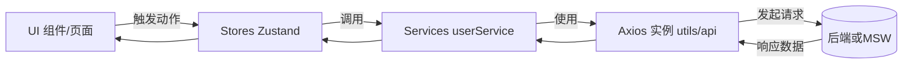

# 架构总览

本项目采用分层的前端架构，围绕 UI、状态、服务与基础设施进行解耦，具备良好的可测试性与可扩展性。

## 分层结构

- UI 层（`src/components`, `src/pages`）: 纯视图与页面编排。
- 路由层（`src/App.tsx`）: 嵌套路由，受保护路由。
- 状态层（`src/stores`）: 使用 Zustand（`authStore`, `uiStore`）。
- 服务层（`src/services`）: 业务 API 封装（`userService`）。
- 基础设施（`src/utils`, `src/constants`）: Axios 实例、日志、校验、性能、常量。
- 国际化（`src/i18n`）: i18next 初始化与资源。
- Mock 与测试（`src/mocks`, `tests/e2e`）: MSW handlers、Playwright 用例。

## 数据与控制流

- 认证链路：
  - 请求拦截器从存储读取 Token，按模式设置 Authorization/CSRF。
  - 401 时自动尝试 `auth/refresh` 刷新 Token 并重试原请求；失败回登录。
  - `ProtectedRoute` 兜底未登录访问。

## 路由结构

- `/` 首页
- `/about` 关于
- `/login` `/register` 认证页面
- `/profile` 个人中心（受保护）
- `/state-demo` 状态管理演示
- `/i18n-demo` 国际化演示
- `*` 404

## 关键模块

- `utils/api.ts`: 统一 Axios、日志、重试、401 刷新、错误上报。
- `stores/authStore.ts`: 登录/注册/登出/初始化，持久化 Token 与用户。
- `components/ProtectedRoute.tsx`: 鉴权守卫。
- `mocks/handlers.ts`: `/api/auth/*` 等接口的模拟与 `/api/*` 兜底。
- `main.tsx` + `Layout.tsx`: 启动 MSW 并等待 `__mswReady`，再初始化认证。

## 配置与环境

- `constants/index.ts` 统一常量，`VITE_*` 环境变量控制 API Base、Cookie/CSRF、监控等。
- `vite.config.ts` 开发代理 `/api -> :8080`，PWA、代码分割、分析。

## 可测试性

- Jest + RTL：组件与逻辑单测。
- Playwright：E2E，自动启服，等待 MSW 就绪，跨浏览器矩阵。

## 可扩展建议

- 引入 OpenAPI/GraphQL 契约与代码生成
- RBAC/ABAC 权限模型与能力前置渲染
- 结构化日志 + TraceId 贯通与 APM 仪表盘
